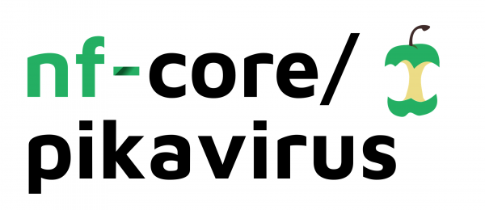

# 

**A workflow for metagenomics**.

[](https://github.com/nf-core/pikavirus/actions)
[](https://github.com/nf-core/pikavirus/actions)
[](https://www.nextflow.io/)

[](https://bioconda.github.io/)
[](https://hub.docker.com/r/nfcore/pikavirus)
[](https://nfcore.slack.com/channels/pikavirus)

## Introduction

**PikaVirus** is a bioinformatics best-practise analysis pipeline for metagenomic analysis following a new approach, based on eliminatory k-mer analysis, followed by assembly and posterior contig-binning.

The pipeline is built using [Nextflow](https://www.nextflow.io), a workflow tool to run tasks across multiple compute infrastructures in a very portable manner. It comes with docker containers making installation trivial and results highly reproducible.

## Quick Start

1. Install [`nextflow`](https://nf-co.re/usage/installation)

2. Install any of [`Docker`](https://docs.docker.com/engine/installation/), [`Singularity`](https://www.sylabs.io/guides/3.0/user-guide/) or [`Podman`](https://podman.io/) for full pipeline reproducibility _(please only use [`Conda`](https://conda.io/miniconda.html) as a last resort; see [docs](https://nf-co.re/usage/configuration#basic-configuration-profiles))_

3. Download the pipeline and test it on a minimal dataset with a single command:

    ```bash
    nextflow run nf-core/pikavirus -profile test,<docker/singularity/podman/conda/institute>
    ```

    > Please check [nf-core/configs](https://github.com/nf-core/configs#documentation) to see if a custom config file to run nf-core pipelines already exists for your Institute. If so, you can simply use `-profile <institute>` in your command. This will enable either `docker` or `singularity` and set the appropriate execution settings for your local compute environment.

4. Start running your own analysis!

    ```bash
    nextflow run nf-core/pikavirus -profile <docker/singularity/podman/conda> --input '*_R{1,2}.fastq.gz'
    ```

See [usage docs](https://nf-co.re/pikavirus/usage) for all of the available options when running the pipeline.

## Pipeline Summary

By default, the pipeline currently performs the following:

* Sequencing quality control (`FastQC`)
* Trimming of low-quality regions in the reads (`FastP`)
* Trimmed sequences quality control (`FastQC`)
* Identification isolation of viral, bacterial, fungal and unknown reads (`Kraken2`)
* Assembly of unknow reads (`MetaQuast`) and mapping against databases (`Kaiju`) to identify new possible pathogens
* Selection of suitable viral, bacterial and fungal references from the provided directory (`MASH`)
* Alignment of viral, bacterial and fungal reads against reference genomes to ensure the presence of certain organisms (`Bowtie2`)

## Documentation

The PikaVirus pipeline comes with documentation about the pipeline: [usage](https://nf-co.re/pikavirus/usage) and [output](https://nf-co.re/pikavirus/output).

<!-- TODO nf-core: Add a brief overview of what the pipeline does and how it works -->

## Tutorial
### Downloading 
PikaVirus requires a big database. A **huge** one in fact. However, thats why we have the [`Download_assembly.py`]() script. This script will download all the viral, fungal or bacterial databases available in RefSeq, GenBank or both.

### Untrusted assemblies
While testing, we have come across some assemblies that did not gather the necessary requirements for the optimal functioning of PikaVirus. Here is a list of all of them so far, and the reasons we have tagged them as excludable.
|Assembly|Reason for exclusion|
|---|---|
| [GCA_006449155.1](https://www.ncbi.nlm.nih.gov/assembly/GCA_006449155.1/) | Assembly too short (20 pb)|
| [GCA_006449195.1](https://www.ncbi.nlm.nih.gov/assembly/GCA_006449195.1/) | Assembly too short (27 pb)|
| [GCA_006449235.1](https://www.ncbi.nlm.nih.gov/assembly/GCA_006449235.1) | Assembly too short (32 bp) |
| [GCA_006449275.1](https://www.ncbi.nlm.nih.gov/assembly/GCA_006449275.1) | Assembly too short (44 bp) |
| [GCA_006449355.1](https://www.ncbi.nlm.nih.gov/assembly/GCA_006449355.1) | Assembly too short (25 bp) |
| [GCA_006449395.1](https://www.ncbi.nlm.nih.gov/assembly/GCA_006449395.1) | Assembly too short (18 bp) |
| [GCA_006449175.1](https://www.ncbi.nlm.nih.gov/assembly/GCA_006449175.1) | Assembly too short (17 bp) |
| [GCA_006449215.1](https://www.ncbi.nlm.nih.gov/assembly/GCA_006449215.1) | Assembly too short (20 bp) |
| [GCA_006449255.1](https://www.ncbi.nlm.nih.gov/assembly/GCA_006449255.1) | Assembly too short (32 bp) |
| [GCA_006449335.1](https://www.ncbi.nlm.nih.gov/assembly/GCA_006449335.1) | Assembly too short (12 bp) |
| [GCA_006449375.1](https://www.ncbi.nlm.nih.gov/assembly/GCA_006449375.1) | Assembly too short (17 bp) |
| [GCA_006449415.1](https://www.ncbi.nlm.nih.gov/assembly/GCA_006449415.1) | Assembly too short (19 bp) |
| [GCA_001857805.1](https://www.ncbi.nlm.nih.gov/assembly/GCA_001857805.1) | No identification potential|
| [GCA_001857825.1](https://www.ncbi.nlm.nih.gov/assembly/GCA_001857825.1) | No identification potential |
| [GCA_001857745.1](https://www.ncbi.nlm.nih.gov/assembly/GCA_001857745.1) | No identification potential |
| [GCA_001857805.1](https://www.ncbi.nlm.nih.gov/assembly/GCA_001857805.1) | No identification potential |
| [GCA_001857825.1](https://www.ncbi.nlm.nih.gov/assembly/GCA_001857825.1) | No identification potential |
| [GCA_013086015.1](https://www.ncbi.nlm.nih.gov/assembly/GCA_013086015.1) | No identification potential |
| [GCA_013088685.1](https://www.ncbi.nlm.nih.gov/assembly/GCA_013088685.1) | No identification potential |
| [GCA_013088695.1](https://www.ncbi.nlm.nih.gov/assembly/GCA_013088695.1) | No identification potential |
| [GCA_013088705.1](https://www.ncbi.nlm.nih.gov/assembly/GCA_013088705.1) | No identification potential |
| [GCA_013088715.1](https://www.ncbi.nlm.nih.gov/assembly/GCA_013088715.1) | No identification potential |
| [GCA_013088725.1](https://www.ncbi.nlm.nih.gov/assembly/GCA_013088725.1) | No identification potential |
| [GCA_013088735.1](https://www.ncbi.nlm.nih.gov/assembly/GCA_013088735.1) | No identification potential |
| [GCA_013088745.1](https://www.ncbi.nlm.nih.gov/assembly/GCA_013088745.1) | No identification potential |
| [GCA_013088755.1](https://www.ncbi.nlm.nih.gov/assembly/GCA_013088755.1) | No identification potential |
| [GCA_013088765.1](https://www.ncbi.nlm.nih.gov/assembly/GCA_013088765.1) | No identification potential |
| [GCA_013088775.1](https://www.ncbi.nlm.nih.gov/assembly/GCA_013088775.1) | No identification potential |
| [GCA_013088785.1](https://www.ncbi.nlm.nih.gov/assembly/GCA_013088785.1) | No identification potential |
| [GCA_013088795.1](https://www.ncbi.nlm.nih.gov/assembly/GCA_013088795.1) | No identification potential |
| [GCA_013088805.1](https://www.ncbi.nlm.nih.gov/assembly/GCA_013088805.1) | No identification potential |
| [GCA_013088815.1](https://www.ncbi.nlm.nih.gov/assembly/GCA_013088815.1) | No identification potential |
| [GCA_013088825.1](https://www.ncbi.nlm.nih.gov/assembly/GCA_013088825.1) | No identification potential |
| [GCA_013088835.1](https://www.ncbi.nlm.nih.gov/assembly/GCA_013088835.1) | No identification potential |
| [GCA_013088845.1](https://www.ncbi.nlm.nih.gov/assembly/GCA_013088845.1) | No identification potential |
| [GCA_013088855.1](https://www.ncbi.nlm.nih.gov/assembly/GCA_013088855.1) | No identification potential |
| [GCA_013088865.1](https://www.ncbi.nlm.nih.gov/assembly/GCA_013088865.1) | No identification potential |
| [GCA_013088875.1](https://www.ncbi.nlm.nih.gov/assembly/GCA_013088875.1) | No identification potential |
| [GCA_013088885.1](https://www.ncbi.nlm.nih.gov/assembly/GCA_013088885.1) | No identification potential |
| [GCA_013088895.1](https://www.ncbi.nlm.nih.gov/assembly/GCA_013088895.1) | No identification potential |
| [GCA_013088905.1](https://www.ncbi.nlm.nih.gov/assembly/GCA_013088905.1) | No identification potential |
| [GCA_013088915.1](https://www.ncbi.nlm.nih.gov/assembly/GCA_013088915.1) | No identification potential |
| [GCA_013088925.1](https://www.ncbi.nlm.nih.gov/assembly/GCA_013088925.1) | No identification potential |
| [GCA_013088935.1](https://www.ncbi.nlm.nih.gov/assembly/GCA_013088935.1) | No identification potential |
| [GCA_013088945.1](https://www.ncbi.nlm.nih.gov/assembly/GCA_013088945.1) | No identification potential |
| [GCA_013088955.1](https://www.ncbi.nlm.nih.gov/assembly/GCA_013088955.1) | No identification potential |
| [GCA_013088965.1](https://www.ncbi.nlm.nih.gov/assembly/GCA_013088965.1) | No identification potential |
| [GCA_013088975.1](https://www.ncbi.nlm.nih.gov/assembly/GCA_013088975.1) | No identification potential |
| [GCA_013088985.1](https://www.ncbi.nlm.nih.gov/assembly/GCA_013088985.1) | No identification potential |
| [GCA_013088995.1](https://www.ncbi.nlm.nih.gov/assembly/GCA_013088995.1) | No identification potential |
| [GCA_013089005.1](https://www.ncbi.nlm.nih.gov/assembly/GCA_013089005.1) | No identification potential |
| [GCA_013089015.1](https://www.ncbi.nlm.nih.gov/assembly/GCA_013089015.1) | No identification potential |
| [GCA_013089025.1](https://www.ncbi.nlm.nih.gov/assembly/GCA_013089025.1) | No identification potential |
| [GCA_013089035.1](https://www.ncbi.nlm.nih.gov/assembly/GCA_013089035.1) | No identification potential |
| [GCA_013089045.1](https://www.ncbi.nlm.nih.gov/assembly/GCA_013089045.1) | No identification potential |
| [GCA_013089055.1](https://www.ncbi.nlm.nih.gov/assembly/GCA_013089055.1) | No identification potential |
| [GCA_013089065.1](https://www.ncbi.nlm.nih.gov/assembly/GCA_013089065.1) | No identification potential |
| [GCA_013089075.1](https://www.ncbi.nlm.nih.gov/assembly/GCA_013089075.1) | No identification potential |
| [GCA_013089085.1](https://www.ncbi.nlm.nih.gov/assembly/GCA_013089085.1) | No identification potential |
| [GCA_013089095.1](https://www.ncbi.nlm.nih.gov/assembly/GCA_013089095.1) | No identification potential |
| [GCA_013089105.1](https://www.ncbi.nlm.nih.gov/assembly/GCA_013089105.1) | No identification potential |
| [GCA_013089115.1](https://www.ncbi.nlm.nih.gov/assembly/GCA_013089115.1) | No identification potential |
| [GCA_013089125.1](https://www.ncbi.nlm.nih.gov/assembly/GCA_013089125.1) | No identification potential |
| [GCA_013089135.1](https://www.ncbi.nlm.nih.gov/assembly/GCA_013089135.1) | No identification potential |
| [GCA_013089145.1](https://www.ncbi.nlm.nih.gov/assembly/GCA_013089145.1) | No identification potential |
| [GCA_013089155.1](https://www.ncbi.nlm.nih.gov/assembly/GCA_013089155.1) | No identification potential |
| [GCA_013089165.1](https://www.ncbi.nlm.nih.gov/assembly/GCA_013089165.1) | No identification potential |
| [GCA_013089175.1](https://www.ncbi.nlm.nih.gov/assembly/GCA_013089175.1) | No identification potential |
| [GCA_013089185.1](https://www.ncbi.nlm.nih.gov/assembly/GCA_013089185.1) | No identification potential |
| [GCA_013089195.1](https://www.ncbi.nlm.nih.gov/assembly/GCA_013089195.1) | No identification potential |
| [GCA_013089205.1](https://www.ncbi.nlm.nih.gov/assembly/GCA_013089205.1) | No identification potential |
| [GCA_013089215.1](https://www.ncbi.nlm.nih.gov/assembly/GCA_013089215.1) | No identification potential |
| [GCA_013089225.1](https://www.ncbi.nlm.nih.gov/assembly/GCA_013089225.1) | No identification potential |
| [GCA_013089235.1](https://www.ncbi.nlm.nih.gov/assembly/GCA_013089235.1) | No identification potential |
| [GCA_013089245.1](https://www.ncbi.nlm.nih.gov/assembly/GCA_013089245.1) | No identification potential |
| [GCA_013089255.1](https://www.ncbi.nlm.nih.gov/assembly/GCA_013089255.1) | No identification potential |
| [GCA_013089265.1](https://www.ncbi.nlm.nih.gov/assembly/GCA_013089265.1) | No identification potential |
| [GCA_013089275.1](https://www.ncbi.nlm.nih.gov/assembly/GCA_013089275.1) | No identification potential |
| [GCA_013089285.1](https://www.ncbi.nlm.nih.gov/assembly/GCA_013089285.1) | No identification potential |
| [GCA_013089295.1](https://www.ncbi.nlm.nih.gov/assembly/GCA_013089295.1) | No identification potential |
| [GCA_013089305.1](https://www.ncbi.nlm.nih.gov/assembly/GCA_013089305.1) | No identification potential |
| [GCA_013089315.1](https://www.ncbi.nlm.nih.gov/assembly/GCA_013089315.1) | No identification potential |
| [GCA_013089325.1](https://www.ncbi.nlm.nih.gov/assembly/GCA_013089325.1) | No identification potential |
| [GCA_013089335.1](https://www.ncbi.nlm.nih.gov/assembly/GCA_013089335.1) | No identification potential |
| [GCA_013089345.1](https://www.ncbi.nlm.nih.gov/assembly/GCA_013089345.1) | No identification potential |
| [GCA_013089355.1](https://www.ncbi.nlm.nih.gov/assembly/GCA_013089355.1) | No identification potential |
| [GCA_013089365.1](https://www.ncbi.nlm.nih.gov/assembly/GCA_013089365.1) | No identification potential |
| [GCA_013089375.1](https://www.ncbi.nlm.nih.gov/assembly/GCA_013089375.1) | No identification potential |
| [GCA_013089385.1](https://www.ncbi.nlm.nih.gov/assembly/GCA_013089385.1) | No identification potential |
| [GCA_013089395.1](https://www.ncbi.nlm.nih.gov/assembly/GCA_013089395.1) | No identification potential |
| [GCA_013089405.1](https://www.ncbi.nlm.nih.gov/assembly/GCA_013089405.1) | No identification potential |
| [GCA_013089415.1](https://www.ncbi.nlm.nih.gov/assembly/GCA_013089415.1) | No identification potential |
| [GCA_013089425.1](https://www.ncbi.nlm.nih.gov/assembly/GCA_013089425.1) | No identification potential |
| [GCA_013089435.1](https://www.ncbi.nlm.nih.gov/assembly/GCA_013089435.1) | No identification potential |
| [GCA_013089445.1](https://www.ncbi.nlm.nih.gov/assembly/GCA_013089445.1) | No identification potential |
| [GCA_013089455.1](https://www.ncbi.nlm.nih.gov/assembly/GCA_013089455.1) | No identification potential |
| [GCA_013089465.1](https://www.ncbi.nlm.nih.gov/assembly/GCA_013089465.1) | No identification potential |
| [GCA_013089475.1](https://www.ncbi.nlm.nih.gov/assembly/GCA_013089475.1) | No identification potential |
| [GCA_013089485.1](https://www.ncbi.nlm.nih.gov/assembly/GCA_013089485.1) | No identification potential |
| [GCA_013089495.1](https://www.ncbi.nlm.nih.gov/assembly/GCA_013089495.1) | No identification potential |
| [GCA_013089505.1](https://www.ncbi.nlm.nih.gov/assembly/GCA_013089505.1) | No identification potential |
| [GCA_013089515.1](https://www.ncbi.nlm.nih.gov/assembly/GCA_013089515.1) | No identification potential |
| [GCA_013089525.1](https://www.ncbi.nlm.nih.gov/assembly/GCA_013089525.1) | No identification potential |
| [GCA_013089535.1](https://www.ncbi.nlm.nih.gov/assembly/GCA_013089535.1) | No identification potential |
| [GCA_013089545.1](https://www.ncbi.nlm.nih.gov/assembly/GCA_013089545.1) | No identification potential |
| [GCA_013089555.1](https://www.ncbi.nlm.nih.gov/assembly/GCA_013089555.1) | No identification potential |
| [GCA_013089565.1](https://www.ncbi.nlm.nih.gov/assembly/GCA_013089565.1) | No identification potential |
| [GCA_013089575.1](https://www.ncbi.nlm.nih.gov/assembly/GCA_013089575.1) | No identification potential |
| [GCA_013089585.1](https://www.ncbi.nlm.nih.gov/assembly/GCA_013089585.1) | No identification potential |
| [GCA_013089595.1](https://www.ncbi.nlm.nih.gov/assembly/GCA_013089595.1) | No identification potential |
| [GCA_013089605.1](https://www.ncbi.nlm.nih.gov/assembly/GCA_013089605.1) | No identification potential |
| [GCA_013089615.1](https://www.ncbi.nlm.nih.gov/assembly/GCA_013089615.1) | No identification potential |
| [GCA_013089625.1](https://www.ncbi.nlm.nih.gov/assembly/GCA_013089625.1) | No identification potential |
| [GCA_013089635.1](https://www.ncbi.nlm.nih.gov/assembly/GCA_013089635.1) | No identification potential |
| [GCA_013089645.1](https://www.ncbi.nlm.nih.gov/assembly/GCA_013089645.1) | No identification potential |
| [GCA_013089655.1](https://www.ncbi.nlm.nih.gov/assembly/GCA_013089655.1) | No identification potential |
| [GCA_013089665.1](https://www.ncbi.nlm.nih.gov/assembly/GCA_013089665.1) | No identification potential |
| [GCA_013089675.1](https://www.ncbi.nlm.nih.gov/assembly/GCA_013089675.1) | No identification potential |
| [GCA_013089685.1](https://www.ncbi.nlm.nih.gov/assembly/GCA_013089685.1) | No identification potential |
| [GCA_013089695.1](https://www.ncbi.nlm.nih.gov/assembly/GCA_013089695.1) | No identification potential |
| [GCA_013089705.1](https://www.ncbi.nlm.nih.gov/assembly/GCA_013089705.1) | No identification potential |
| [GCA_013089715.1](https://www.ncbi.nlm.nih.gov/assembly/GCA_013089715.1) | No identification potential |
| [GCA_013089725.1](https://www.ncbi.nlm.nih.gov/assembly/GCA_013089725.1) | No identification potential |
| [GCA_013089735.1](https://www.ncbi.nlm.nih.gov/assembly/GCA_013089735.1) | No identification potential |
| [GCA_013089745.1](https://www.ncbi.nlm.nih.gov/assembly/GCA_013089745.1) | No identification potential |
| [GCA_013089755.1](https://www.ncbi.nlm.nih.gov/assembly/GCA_013089755.1) | No identification potential |
| [GCA_013089765.1](https://www.ncbi.nlm.nih.gov/assembly/GCA_013089765.1) | No identification potential |
| [GCA_013089775.1](https://www.ncbi.nlm.nih.gov/assembly/GCA_013089775.1) | No identification potential |
| [GCA_013089785.1](https://www.ncbi.nlm.nih.gov/assembly/GCA_013089785.1) | No identification potential |
| [GCA_013089795.1](https://www.ncbi.nlm.nih.gov/assembly/GCA_013089795.1) | No identification potential |
| [GCA_013089805.1](https://www.ncbi.nlm.nih.gov/assembly/GCA_013089805.1) | No identification potential |
| [GCA_013089815.1](https://www.ncbi.nlm.nih.gov/assembly/GCA_013089815.1) | No identification potential |
| [GCA_013089825.1](https://www.ncbi.nlm.nih.gov/assembly/GCA_013089825.1) | No identification potential |
| [GCA_013089835.1](https://www.ncbi.nlm.nih.gov/assembly/GCA_013089835.1) | No identification potential |
| [GCA_013089845.1](https://www.ncbi.nlm.nih.gov/assembly/GCA_013089845.1) | No identification potential |
| [GCA_013089855.1](https://www.ncbi.nlm.nih.gov/assembly/GCA_013089855.1) | No identification potential |
| [GCA_013089865.1](https://www.ncbi.nlm.nih.gov/assembly/GCA_013089865.1) | No identification potential |
| [GCA_013089875.1](https://www.ncbi.nlm.nih.gov/assembly/GCA_013089875.1) | No identification potential |
| [GCA_013089885.1](https://www.ncbi.nlm.nih.gov/assembly/GCA_013089885.1) | No identification potential |
| [GCA_013089895.1](https://www.ncbi.nlm.nih.gov/assembly/GCA_013089895.1) | No identification potential |
| [GCA_013089905.1](https://www.ncbi.nlm.nih.gov/assembly/GCA_013089905.1) | No identification potential |
| [GCA_013089915.1](https://www.ncbi.nlm.nih.gov/assembly/GCA_013089915.1) | No identification potential |
| [GCA_013089925.1](https://www.ncbi.nlm.nih.gov/assembly/GCA_013089925.1) | No identification potential |
| [GCA_013089935.1](https://www.ncbi.nlm.nih.gov/assembly/GCA_013089935.1) | No identification potential |
| [GCA_013089945.1](https://www.ncbi.nlm.nih.gov/assembly/GCA_013089945.1) | No identification potential |
| [GCA_013089955.1](https://www.ncbi.nlm.nih.gov/assembly/GCA_013089955.1) | No identification potential |
| [GCA_013089965.1](https://www.ncbi.nlm.nih.gov/assembly/GCA_013089965.1) | No identification potential |
| [GCA_013089975.1](https://www.ncbi.nlm.nih.gov/assembly/GCA_013089975.1) | No identification potential |
| [GCA_013089985.1](https://www.ncbi.nlm.nih.gov/assembly/GCA_013089985.1) | No identification potential |
| [GCA_013089995.1](https://www.ncbi.nlm.nih.gov/assembly/GCA_013089995.1) | No identification potential |
| [GCA_013090005.1](https://www.ncbi.nlm.nih.gov/assembly/GCA_013090005.1) | No identification potential |
| [GCA_013090015.1](https://www.ncbi.nlm.nih.gov/assembly/GCA_013090015.1) | No identification potential |
| [GCA_013090025.1](https://www.ncbi.nlm.nih.gov/assembly/GCA_013090025.1) | No identification potential |
| [GCA_013090035.1](https://www.ncbi.nlm.nih.gov/assembly/GCA_013090035.1) | No identification potential |
| [GCA_013090045.1](https://www.ncbi.nlm.nih.gov/assembly/GCA_013090045.1) | No identification potential |
| [GCA_013096315.1](https://www.ncbi.nlm.nih.gov/assembly/GCA_013096315.1) | No identification potential |

**NOTE**: some of these assemblies may have been removed from the NCBI. In addition, there might be a lot of other assemblies. 

## Credits

PikaVirus 2.0 was originally written by [Guillermo Jorge Gorines Cordero](https://github.com/GuilleGorines), under supervision of the BU-ISCIII team in Madrid, Spain.

PikaVirus has been developed under the `nf-core` community guidelines, tools and best practises, despite not being an official nf-core pipeline. You can cite the `nf-core` publication as follows:

> **The nf-core framework for community-curated bioinformatics pipelines.**
>
> Philip Ewels, Alexander Peltzer, Sven Fillinger, Harshil Patel, Johannes Alneberg, Andreas Wilm, Maxime Ulysse Garcia, Paolo Di Tommaso & Sven Nahnsen.
>
> _Nat Biotechnol._ 2020 Feb 13. doi: [10.1038/s41587-020-0439-x](https://dx.doi.org/10.1038/s41587-020-0439-x).
> ReadCube: [Full Access Link](https://rdcu.be/b1GjZ)

We thank the following people for their extensive assistance in the development of this pipeline:

## Contributions and Support

If you would like to contribute to this pipeline, please see the [contributing guidelines](.github/CONTRIBUTING.md).

## Citations

<!-- If you use  nf-core/pikavirus for your analysis, please cite it using the following doi: [10.5281/zenodo.XXXXXX](https://doi.org/10.5281/zenodo.XXXXXX) -->

In addition, references of tools and data used in this pipeline are as follows:

> **Improved metagenomic analysis with Kraken 2.**
>
> Derrick E Wood, Jennifer Lu & Ben Langmead.
>
> _Genome biology_ 2019 Nov 28. doi: [10.1186/s13059-019-1891-0](https://doi.org/10.1186/s13059-019-1891-0)
>

>**fastp: an ultra-fast all-in-one FASTQ preprocessor.**
>
> Shifu Chen, Yanqing Zhou, Yaru Chen, Jia Gu.
> 
> _Bioinformatics_, Volume 34, Issue 17, 01 September 2018, Pages i884–i890,. doi: [10.1093/bioinformatics/bty560](https://doi.org/10.1093/bioinformatics/bty560)
>
<!-- 
>**Fast and sensitive taxonomic classification for metagenomics with Kaiju**
>
> Peter Menzel, Kim Lee Ng & Anders Krogh
>
> _Nature Communications_ volume 7, Article number: 11257 (2016). doi [10.1038/ncomms11257](https://doi.org/10.1038/ncomms11257)
>
>**QUAST: quality assessment tool for genome assemblies**
>
> Alexey Gurevich, Vladislav Saveliev, Nikolay Vyahhi & Glenn Tesler 
>
> _Bioinformatics_ Volume 29, Issue 8, 15 April 2013, Pages 1072–1075. doi [10.1093/bioinformatics/btt086](https://doi.org/10.1093/bioinformatics/btt086)

>**metaSPAdes: a new versatile metagenomic assembler**
>
> Sergey Nurk1, Dmitry Meleshko1, Anton Korobeynikov and Pavel A. Pevzner
>
> _Genome Res_ 27: 824-834 (2017). doi [10.1101/gr.213959.116](https://www.doi.org/10.1101/gr.213959.116)
>

-->

>**Bioconda: sustainable and comprehensive software distribution for the life sciences**
>
> Björn Grüning, Ryan Dale, Andreas Sjödin, Brad A. Chapman, Jillian Rowe, Christopher H. Tomkins-Tinch, Renan Valieris, Johannes Köster & The Bioconda Team
>
> _Nature Methods_ volume 15, pages 475–476(2018). doi [10.1038/s41592-018-0046-7](https://doi.org/10.1038/s41592-018-0046-7)
>

>**Mash: fast genome and metagenome distance estimation using MinHash**
>
> Brian D. Ondov, Todd J. Treangen, Páll Melsted, Adam B. Mallonee, Nicholas H. Bergman, Sergey Koren & Adam M. Phillippy
>
> _Genome Biology_ 17, Article number: 132 (2016). doi [10.1186/s13059-016-0997-x](https://www.doi.org/10.1186/s13059-016-0997-x)

